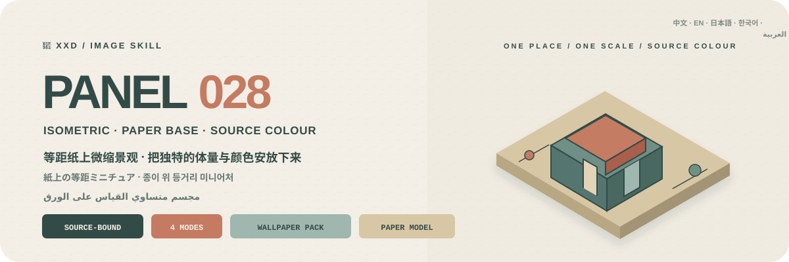
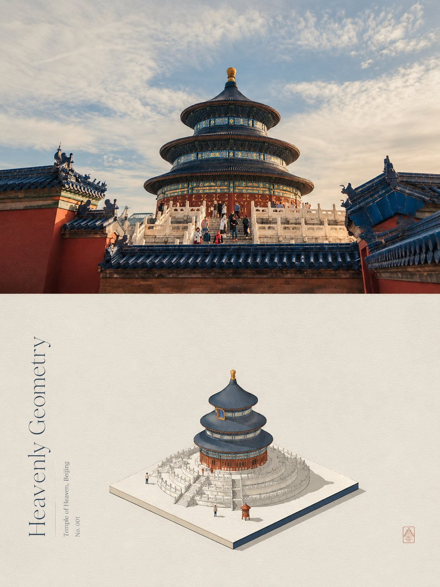
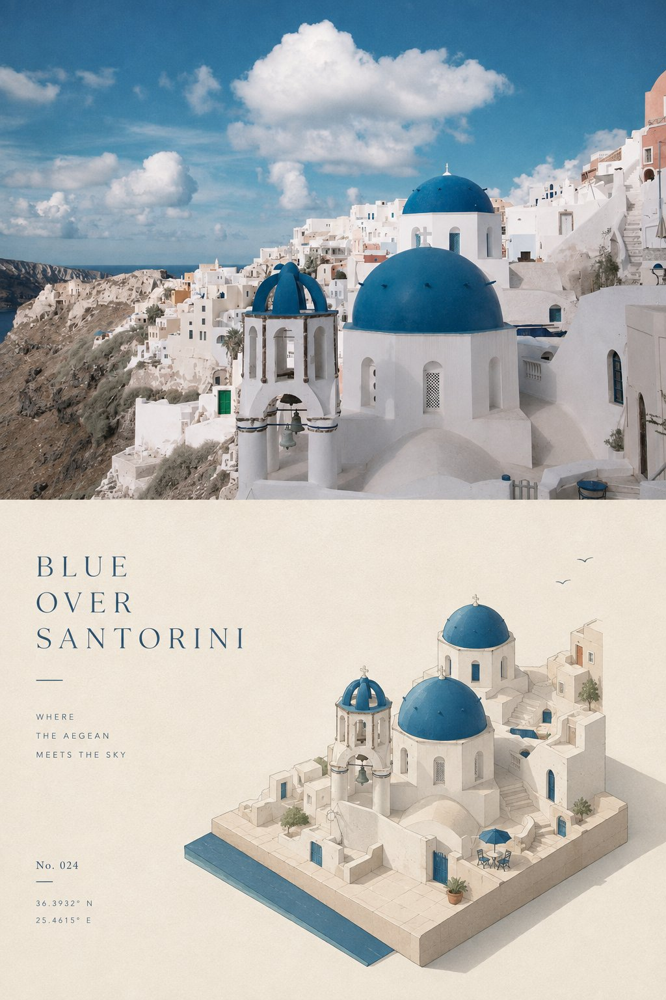
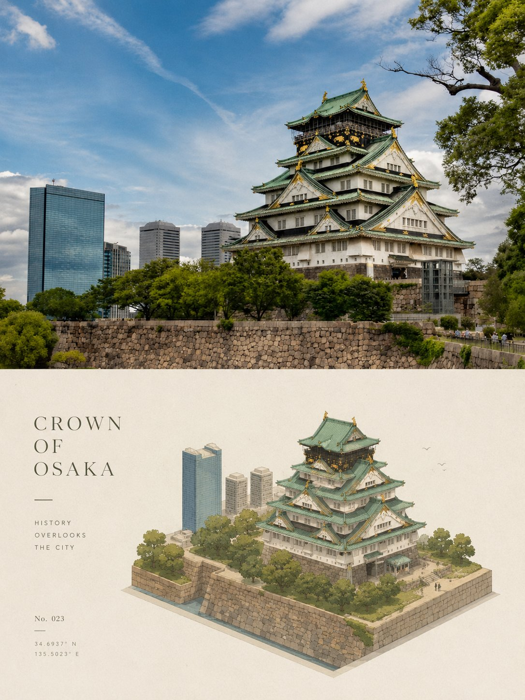
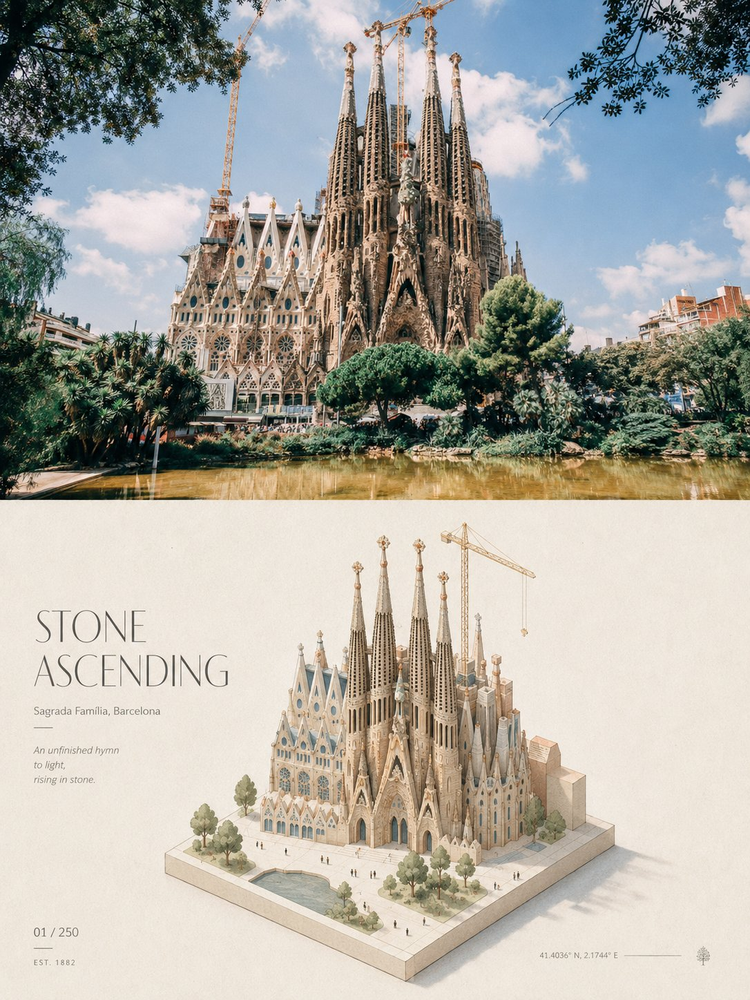

<p align="center">
  
</p>

<div align="center" dir="rtl">

# 🦁 XXD Panel 028

### يضع الصورة كمجسم متساوي القياس على الورق بألوان المصدر

[](./SKILL.md)
[](#أربعة-مخرجات-ومنطق-واحد-للمجسم-الورقي)
[](#الحدود-والثقة)

<a href="README.md">简体中文</a> · <a href="README.en.md">English</a> · <a href="README.ja.md">日本語</a> · <a href="README.ko.md">한국어</a> · <strong>العربية</strong>

</div>

<div dir="rtl">

> إسقاط متساوي القياس · قاعدة ورقية صغيرة · ألوان من المصدر · حبر دقيق · نموذج تحريري

XXD Panel 028 مهارة لتوليد الصور مخصّصة لـ Codex والوكلاء المتوافقين. تلخّص هوية الصورة ومحيطها ووضعيتها وعلاقاتها في مجسم متعامد متساوي القياس أو نموذج معماري موضوع على قاعدة ورقية صغيرة لها سند من المصدر.

تصنع الكتل الواضحة وقص الحافة والإسقاط الخفيف وتفاصيل قليلة جداً إحساس المقياس والعزلة وقيمة الاقتناء، مع ورق مفتوح واسع. تُستخرج الألوان من المصدر وتُختزل وتُنقّى وتُلطّف، ويصنع الحبر الدقيق والمساحات المسطحة والظل الخفيف وحبيبات الورق الدقيقة رسماً تحريرياً هادئاً.

## لماذا توجد 028؟

يتحوّل «المجسم المتساوي القياس» بسهولة إلى مدينة ألعاب مزدحمة أو أصول لعبة جاهزة أو لوحة نعناعية ومرجانية لا صلة لها بالصورة.

تعكس 028 هذا الترتيب:

```text
تثبيت الهوية والمحيط والوضع والعلاقة ← تلخيصها إلى كتل متعامدة وطبقات قليلة ← وضعها على قاعدة ورقية من المصدر ← إظهار المقياس بالحافة والظل والتفاصيل القليلة ← اختزال ألوان المصدر وتلطيفها ← الإنهاء بالحبر الدقيق واللون المسطح وحبيبات الورق
```

إذا أمكن استبدال المصدر بصورة لا صلة لها من دون تغيير جوهري في محيط المجسم أو هرمية الكتل أو شكل القاعدة أو علامات المقياس أو لوحة الألوان أو علاقة النص، فالنتيجة ليست 028.

## العقد البصري لـ 028

- **مجسم خاص بالمصدر:** تدخل ثلاثة أدلة على الأقل من الهوية والمحيط والوضع والحركة والوظيفة والفتحات والمقياس والعلاقة في نموذج واحد.
- **قاعدة ورقية واحدة:** يوضع الموضوع على قصاصة أو قاعدة منخفضة أو أرض مصغرة لها سند من المصدر ويحيط به ورق واسع.
- **علامات مقياس مقتصدة:** توضح فروق الكتل وقص الحافة والظل الخفيف وقليل من الأشخاص أو الأشجار المقياس بلا بؤرة ثانية.
- **إسقاط متساوي القياس:** بلا منظور فوتوغرافي أو فضاء مستحيل أو مدينة مزدحمة أو مستوى لعبة.
- **لوحة من المصدر:** تُختزل الألوان المميزة وتُنقّى وتُلطّف مع حفظ علاقة الدافئ والبارد، من دون بطاقة باستيل ثابتة.
- **مادة ورقية:** يصنع الحبر الدقيق واللون المسطح ودرجات اللون والظل الخفيف وحبيبات الورق البنية.
- **حروف تحريرية رفيعة:** يصطف عنوان قصير ونص مجهري مع حافة الفراغ أو القاعدة أو المحور الأفقي أو البنية المتساوية القياس.

## النماذج · من X

> [Xiaoxiaodong (@xiaoxiaodong01)](https://x.com/xiaoxiaodong01/status/2090447110168822128) · 2026-08-20<br>
> GPT2 x 立体 x 模型 x 微缩 x 美学提示词 x VOL.028

<table>
  <tr>
    <td width="50%"><a href="https://x.com/xiaoxiaodong01/status/2090447110168822128"></a></td>
    <td width="50%"><a href="https://x.com/xiaoxiaodong01/status/2090447110168822128"></a></td>
  </tr>
  <tr>
    <td width="50%"><a href="https://x.com/xiaoxiaodong01/status/2090447110168822128"></a></td>
    <td width="50%"><a href="https://x.com/xiaoxiaodong01/status/2090447110168822128"></a></td>
  </tr>
</table>

<p align="center"><a href="https://x.com/xiaoxiaodong01/status/2090447110168822128">عرض المنشور الأصلي والتوجيه كاملاً ←</a></p>

تعرض هذه النماذج الدافع الجمالي للإصدار 028 فقط؛ ولا تصبح موضوعاتها أو تكوينها أو ألوانها أو نصوصها أو نسبة اللوحة السابقة مراجع للتوليد أو إعدادات افتراضية حالية.

## الموجّه الأصلي هو المرجع الجمالي الوحيد

الملف `references/028-source.md` هو المرجع الإبداعي والجمالي الوحيد للمشروع. لا تلخّص المهارة نصّه ولا توسعه، ولا تفرض لوحة ألوان مشتركة أو «دافعاً جمالياً» أو عنواناً أو حزمة نصوص قصيرة. يتبع GPT Image 2 قواعد الموجّه الأصلي نفسه في اللون والخامة والتكوين والفراغ والنص والطباعة.

لا يغيّر النمط والحجم إلا حاوية العرض القديمة 3:4 ذات الجزأين العلوي والسفلي. في النمط الأفقي يُنقل «الصورة العليا／التصميم السفلي» إلى اليسار／اليمين، وفي نمط التصميم وحده والخلفيات يمتد منطق التصميم السفلي إلى اللوحة كاملة. تبقى كل تعليمات الموجّه الأخرى فعّالة.

## الموجّه الأصلي هو المرجع الجمالي الوحيد

الملف `references/028-source.md` هو المرجع الإبداعي والجمالي الوحيد للمشروع. لا تلخّص المهارة نصّه ولا توسعه، ولا تفرض لوحة ألوان مشتركة أو «دافعاً جمالياً» أو عنواناً أو حزمة نصوص قصيرة. يتبع GPT Image 2 قواعد الموجّه الأصلي نفسه في اللون والخامة والتكوين والفراغ والنص والطباعة.

لا يغيّر النمط والحجم إلا حاوية العرض القديمة 3:4 ذات الجزأين العلوي والسفلي. في النمط الأفقي يُنقل «الصورة العليا／التصميم السفلي» إلى اليسار／اليمين، وفي نمط التصميم وحده والخلفيات يمتد منطق التصميم السفلي إلى اللوحة كاملة. تبقى كل تعليمات الموجّه الأخرى فعّالة.

## الموجّه الأصلي هو المرجع الجمالي الوحيد

الملف `references/028-source.md` هو المرجع الإبداعي والجمالي الوحيد للمشروع. لا تلخّص المهارة نصّه ولا توسعه، ولا تفرض لوحة ألوان مشتركة أو «دافعاً جمالياً» أو عنواناً أو حزمة نصوص قصيرة. يتبع GPT Image 2 قواعد الموجّه الأصلي نفسه في اللون والخامة والتكوين والفراغ والنص والطباعة.

لا يغيّر النمط والحجم إلا حاوية العرض القديمة 3:4 ذات الجزأين العلوي والسفلي. في النمط الأفقي يُنقل «الصورة العليا／التصميم السفلي» إلى اليسار／اليمين، وفي نمط التصميم وحده والخلفيات يمتد منطق التصميم السفلي إلى اللوحة كاملة. تبقى كل تعليمات الموجّه الأخرى فعّالة.

## الموجّه الأصلي هو المرجع الجمالي الوحيد

الملف `references/028-source.md` هو المرجع الإبداعي والجمالي الوحيد للمشروع. لا تلخّص المهارة نصّه ولا توسعه، ولا تفرض لوحة ألوان مشتركة أو «دافعاً جمالياً» أو عنواناً أو حزمة نصوص قصيرة. يتبع GPT Image 2 قواعد الموجّه الأصلي نفسه في اللون والخامة والتكوين والفراغ والنص والطباعة.

لا يغيّر النمط والحجم إلا حاوية العرض القديمة 3:4 ذات الجزأين العلوي والسفلي. في النمط الأفقي يُنقل «الصورة العليا／التصميم السفلي» إلى اليسار／اليمين، وفي نمط التصميم وحده والخلفيات يمتد منطق التصميم السفلي إلى اللوحة كاملة. تبقى كل تعليمات الموجّه الأخرى فعّالة.

## الموجّه الأصلي هو المرجع الجمالي الوحيد

الملف `references/028-source.md` هو المرجع الإبداعي والجمالي الوحيد للمشروع. لا تلخّص المهارة نصّه ولا توسعه، ولا تفرض لوحة ألوان مشتركة أو «دافعاً جمالياً» أو عنواناً أو حزمة نصوص قصيرة. يتبع GPT Image 2 قواعد الموجّه الأصلي نفسه في اللون والخامة والتكوين والفراغ والنص والطباعة.

لا يغيّر النمط والحجم إلا حاوية العرض القديمة 3:4 ذات الجزأين العلوي والسفلي. في النمط الأفقي يُنقل «الصورة العليا／التصميم السفلي» إلى اليسار／اليمين، وفي نمط التصميم وحده والخلفيات يمتد منطق التصميم السفلي إلى اللوحة كاملة. تبقى كل تعليمات الموجّه الأخرى فعّالة.

## أربعة مخرجات قابلة للجمع

يمكن اختيار واحد أو أكثر من `top-bottom` و`left-right` و`design-only` و`wallpaper-pack`. تُولَّد اللوحة المزدوجة كصورة نهائية كاملة افتراضياً؛ ولا يُستخدم الدمج الحتمي إلا بعد فشل إعادة المحاولة، أو للحفاظ الحرفي على بكسلات المصدر، أو لمعايرة الحجم بلا فقد.

يمكن أيضاً اختيار عدة أحجام: ملاءمة تلقائية، نسبة المصدر، 1:1، 3:4، 4:3، 4:5، 5:4، 2:3، 3:2، 9:16، 16:9، 21:9، 5:7، 7:5، أو نسبة مخصصة／أبعاد بكسل دقيقة. لا يوجد حجم افتراضي صامت، وتُعاد صياغة كل نسبة مختلفة بصورة مستقلة من الموجّه الأصلي نفسه.

حزمة الخلفيات إما مترابطة أو مستقلة. في الحزمة المترابطة تُنشأ صورة مرجعية أولى، ثم يُعاد تكوين كل جهاز من المصدر الأصلي مع تلك الصورة؛ ولا تُقص صورة واحدة آلياً إلى أربعة أحجام.

## أوضاع النص

قبل التوليد يُحسم خيار واحد:

1. **ينشئ النموذج النص وفق الموجّه الأصلي**: يحدد المستخدم اللغة أو المنطقة فقط، ويتبع GPT Image 2 منطق الموجّه في المحتوى والكمية والنبرة والطباعة.
2. **استخدام نصي الحرفي**: يُمرر كما هو بلا إعادة صياغة أو ترجمة أو عنوان إضافي، مع بقاء الطباعة خاضعة للموجّه الأصلي.
3. **بلا نص**: يُمنع كل نص أو شبه نص.

لا تكتب المهارة الخارجية عنواناً أو نصوصاً قصيرة مسبقاً. تُحسم لغة الإخراج مستقلة عن لغة الواجهة، ولا تُستنتج من الشخص أو المشهد أو اسم الملف.

## أولوية اللوحة الكاملة وحدود الصورة النقطية

يتولى نموذج الصور إعادة البناء الجمالي للعمل النهائي كله، وتستخدم التركيبات الثنائية أيضاً توليد لوحة كاملة واحدة افتراضياً. ولا يبقى `scripts/compose_panel.py` إلا للاسترداد المشروط ومعايرة البكسلات بلا فقد والتدقيق للقراءة فقط؛ فلا يعمل مسبقاً ولا يحكم على النجاح الجمالي.

كل التسليمات ملفات PNG نقطية، وينشئ كل استدعاء مهمة جديدة تحت `~/Desktop/xxd/`. ولا يكشف مسار الصور المضبوط سوى حالة منزوعة التفاصيل، من دون المزوّد أو نقطة الاتصال أو بيانات الاعتماد أو الرؤوس أو التوجيهات أو الاستجابات أو معلومات الحساب. ولا تصلح SVG أو HTML أو Canvas أو الرسوم البرمجية بديلاً للعمل النهائي.

## عناصر اختيار ومعاملات مضمنة

عندما توفّر بيئة التشغيل عناصر تفاعلية حقيقية، تفضّل المهارة بطاقات الاختيار: يمكن تحديد عدة أنماط وعدة مقاسات عادية، بينما يكون نمط النص وعلاقة الخلفيات اختياراً واحداً. تشمل المقاسات: الضبط التلقائي، ونسبة المصدر، و1:1 و3:4 و4:3 و4:5 و5:4 و2:3 و3:2 و9:16 و16:9 و21:9 و5:7 و7:5، إضافة إلى نسبة أو دقة مخصصة. وإذا لم تتوفر عناصر تفاعلية، تستخدم المهارة قائمة مرقمة واضحة متعددة الأسطر بدلاً من مربعات اختيار وهمية غير قابلة للنقر.

يمكن أيضاً تمرير كل الإعدادات كمتغيرات ضمن أمر الاستدعاء:

```text
/xxd-panel-028 photo.jpg --mode top-bottom,design-only --size auto,3:4,9:16 --text prompt --locale ja-JP
```

تشمل المعاملات `--mode` و`--size` القابل للتكرار أو الفصل بالفواصل، و`--text prompt|exact|none`، و`--locale`، و`--copy`، و`--wallpaper linked|independent`، و`--wallpaper-size`، و`--out`. عند اكتمال المعاملات تُتخطّى جميع أسئلة الإعداد ويبدأ التوليد مباشرة؛ وعند نقصها يُسأل فقط عن القيم الناقصة. تُعاد صياغة كل نسبة أبعاد بصورة مستقلة، وتبقى حزمة خلفيات الأجهزة الأربعة فرعاً مستقلاً لا يتضاعف آلياً مع المقاسات العادية.

## أولوية نموذج الصور

يظل GPT Image 2 الخيار الأول افتراضياً، مع الحفاظ على سير العمل الحالي: مرجع المصدر عالي الوفاء، وحسم اللوحة النهائية قبل التوليد، وتوليد اللوحة الثنائية كاملة في عملية واحدة، وعدم استخدام التركيب البرمجي إلا كحل احتياطي مشروط.

يمكن أيضاً استخدام Seedance 5.0 Pro أو Nano Banana Pro (Gemini Image Pro) أو Nano Banana 2 (Gemini Image Flash) أو نموذج نقطي متوافق آخر عندما يكون متاحاً فعلاً عبر الأدوات الحالية أو المسارات المضبوطة، وقادراً على تلبية وفاء المصدر ونسبة اللوحة النهائية ونص اللغة المستهدفة والمراجع المتعددة للخلفيات المترابطة. يغيّر النموذج البديل مسار التوليد فقط، ولا يغيّر الأنماط أو اللوحة أو النص أو اللغة أو علاقة الخلفيات أو أولوية اللوحة الكاملة.

إذا لم يوجد مسار مناسب، تطلب المهارة من المستخدم تفعيل أداة لتوليد الصور أو تقديم API Key. يمكن استخدام بيانات الاعتماد التي يقدمها المستخدم للمهمة الحالية من دون تكرارها أو عرضها أو تسجيلها أو كشفها. ولا تُحفظ طويلاً ولا تتغير إعدادات المزوّد أو الحساب أو الفوترة أو المسار العام إلا بطلب صريح من المستخدم.

## البدء

```bash
git clone https://github.com/nevertoday/xxd-panel-028.git
mkdir -p ~/.codex/skills
ln -s "$(pwd)/xxd-panel-028" ~/.codex/skills/xxd-panel-028
```

يمكن لمستخدمي Claude Code ربط المجلد نفسه بـ `~/.claude/skills/xxd-panel-028`. أعد تشغيل جلسة الوكيل بعد التثبيت.

```text
$xxd-panel-028
حوّل هذه الصورة إلى تكوين يسار/يمين، واستخرج العبارة من معناها، واكتبها بالعربية الفصحى المعاصرة.
```

يمكن أيضاً استدعاء المهارة بصورة وحدها. ستسأل أولاً عن نمط واحد أو عدة أنماط وعن إعداد النص في قائمة مرقمة متعددة الأسطر؛ ويسأل نمط الخلفيات أيضاً عن الترابط والمقاسات.

المواصفات الكاملة:

- [مسار عمل المهارة](SKILL.md)
- [مهايئ التشغيل الصيني](references/xxd-panel-028-prompt.zh-CN.md)
- [مهايئ التشغيل الإنجليزي](references/xxd-panel-028-prompt.en.md)
- [موجز الأسلوب الأصلي](references/028-source.md)

## الحدود والثقة

- تبقى كل صورة داخل مهمتها ولا تستعير موضوعاً أو لوناً أو نصاً أو تكويناً من مدخل آخر أو نتيجة قديمة أو نموذج.
- ينشئ كل استدعاء مجلد مهمة جديداً، حتى عند تكرار المصدر والمعلمات.
- النتائج ملفات PNG نقطية، وليست SVG أو HTML أو Canvas أو بديلاً مرسوماً برمجياً.
- لا يعرض جسر الصور المضبوط سوى حالة منزوعة التفاصيل، ولا يكشف المزوّد أو نقطة الاتصال أو الرؤوس أو بيانات الاعتماد أو التوجيه أو نص الاستجابة.
- يعيد كل نمط عادي مختار ملفاً واحداً، ويضيف اختيار `wallpaper-pack` أربع خلفيات مستقلة. يعيد خيار «الكل» سبعة ملفات PNG لكل مصدر داخل أربعة مجلدات أنماط متجاورة، ولا ينشئ لوحة تجميع أو عرضاً عاماً.

يحتاج التركيب المحلي إلى Python 3 وPillow. يستخدم الجسر الآمن `tomllib` في Python 3.11 أو أحدث. ويحتاج توليد الصور إلى قدرة نقطية مدمجة في الوكيل المضيف أو مسار نقطي متوافق ومضبوط مسبقاً.

## المستودع

```text
xxd-panel-028/
├── SKILL.md
├── README.md / README.en.md / README.ja.md / README.ko.md / README.ar.md
├── agents/openai.yaml
├── assets/banner.svg + examples/ (محجوز لنماذج محلية مستقبلية)
├── scripts/compose_panel.py + configured_imagegen.py
└── references/xxd-panel-028-prompt.zh-CN.md + xxd-panel-028-prompt.en.md + 028-source.md
```

## عن XXD

XXD هو الاختصار التجاري لاسم Xiaoxiaodong. أنشأ المشروع ويديره [@xiaoxiaodong01](https://x.com/xiaoxiaodong01).

## الدعم والعضوية

### استشارة متعمقة · 299 يواناً صينياً/ساعة

تبلغ تكلفة الاستشارة الفردية المتعمقة في استخدام Skills مقدار 299 يواناً صينياً في الساعة. للحجز، تواصل عبر رمز WeChat أدناه.

### مجموعة مستخدمي Xiaoxiaodong Skills · 99 يواناً صينياً

تتيح دفعة واحدة قدرها 99 يواناً الانضمام إلى مجموعة تبادل سير العمل ومناقشة الأعمال والدعم بين المستخدمين. ولا تشمل الاستشارة الفردية المحسوبة بالساعة.

### Knowledge Planet＋مكتبة توجيهات الأعضاء · 699 يواناً صينياً/سنة

[Knowledge Planet](https://wx.zsxq.com/group/15554814142882) و[مكتبة توجيهات XXD](https://vip.xiaoxiaodong.ai/) عضوية واحدة: **دفعة سنوية واحدة تفتح الخدمتين من دون شراء ثانٍ.**

1. اشترك عبر Knowledge Planet ثم تواصل عبر WeChat للحصول على رمز استبدال المكتبة.
2. اشترك عبر مكتبة التوجيهات ثم تواصل عبر WeChat للحصول على دعوة إلى Knowledge Planet.

<p align="center">
  <a href="https://xiaoxiaodong.pages.dev/assets/wechat-qr.png"></a>
</p>

<div align="center" dir="rtl">

**لا تضع الصورة في مدينة ألعاب؛ ضع كتلتها ولونها وعزلتها الفريدة على الورق.**

</div>

</div>

---

<div align="center" dir="rtl">
  <h2>☕ ادعم هذا المشروع مفتوح المصدر</h2>
  <p>إذا وفّر عليك المشروع وقتاً، فإن نجمة أو مشاركة أو فنجان قهوة يساعد في استمراره.</p>
  <table><tr><td align="center" width="240">
    <a href="https://github.com/nevertoday/zhongguo-traditional-colors/blob/main/docs/images/buy-me-a-coffee-qr.png?raw=true"></a><br>
    <strong>Buy me a coffee</strong><br><sub>امسح رمز QR أو افتحه لدعم Xiaoxiaodong</sub>
  </td></tr></table>
  <p><sub>الدعم اختياري تماماً ولا يغيّر حق الوصول إلى هذا المشروع مفتوح المصدر.</sub></p>
</div>
